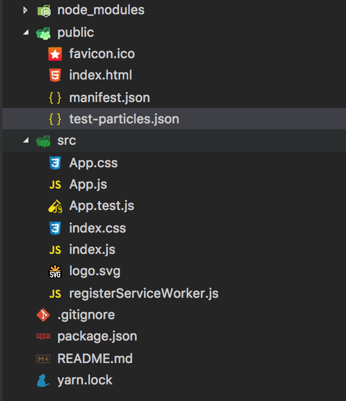
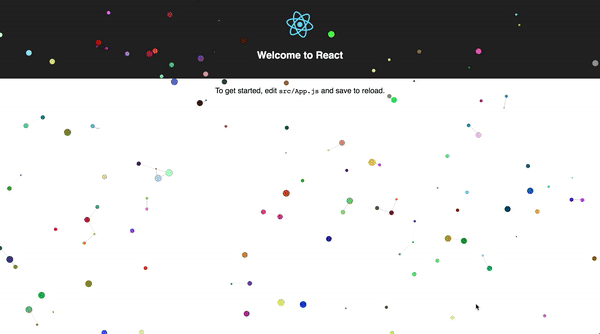

ReactParticles.js
===============

### Independently configurable React component based on [particles.js](http://vincentgarreau.com/particles.js/) by [vincentgarreau](https://github.com/VincentGarreau).


## Overview
Plug-and-play into existing React projects using the same downloadable .json configuration as the original [particles.js](http://vincentgarreau.com/particles.js/). Multiple components can be added to the same component - or across many - and can be configured independently using seperate .json files.


## Install
```
npm i reactparticles.js --save

          or

yarn add reactparticles.js
```

## Basic Usage

1. Import it
2. Place it in a container or component
3. Pass it a unique id prop
4. Pass it a config file (optional)


```jsx
import ... ;
import ... ;
import Particles from 'reactparticles.js';

export default class YourComponent extends Component {
  render () {
    return (
      <div className="your-component-container">
        <Particles id="your-component-particles"/>
      </div>
    );
  }
}
```

## Using Multiple Configurations 

1. Import
2. Place each Particles component in a seperate container or component 
3. Pass each a unique id prop
4. Pass each a config file

```jsx
import ... ;
import ... ;
import Particles from 'reactparticles.js';

export default class Example extends Component {
  render () {
    return (
      <div className="tiles-container">
        <div className="tile-1">
          <Particles 
            id="tile-1-particles"
            config="particles/tile-1-particles.json"
          />
        </div>
        <div className="tile-2">
          <Particles 
            id="tile-2-particles"
            config="particles/tile-2-particles.json"
          />
        </div>
        <div className="tile-3">
          <Particles 
            id="tile-3-particles"
            config="particles/tile-3-particles.json"
          />
        </div>
        <div className="tile-4">
          <Particles 
            id="tile-4-particles"
            config="particles/tile-4-particles.json"
          />
        </div>
      </div>
    );
  }
}
```
### Public folder structure for multiple configurations


## Quick Start with Create React App

```
create-react-app particles-app
...
...
...
cd particles-app
yarn add reactparticles.js
```

### import and add the component:

```jsx
import React, { Component } from 'react';
import logo from './logo.svg';
import './App.css';
import Particles from 'reactparticles.js';

class App extends Component {
  render() {
    return (
      <div className="App">
        <header className="App-header">
          
          <h1 className="App-title">Welcome to React</h1>
        </header>

        <Particles id="test"/>

        <p className="App-intro">
          To get started, edit <code>src/App.js</code> and save to reload.
        </p>
      </div>
    );
  }
}

export default App;
```

### Start the server

```
yarn start
```

### Result:


### Adding a config file
- Create and download a config file from [here](http://vincentgarreau.com/particles.js/) or use the .json example in the _Configuration Files_ section below.

- Create a test-particles.json file in your public folder: 



- Add your configuration json into the file and save

- Go into your App.js file and pass the config file to your component:

```jsx
<Particles id="test" config="test-particles.json"/>
```

### Save and view the results!



## Configuration Files

- Your config file path is relative to your index.html (or file with the id root for React to render: \<div id="root"></div>

- Create and downloaded your config files from [the particle.js site](http://vincentgarreau.com/particles.js/) or manipulate the example below.

```json
{
  "particles": {
    "number": {
      "value": 125,
      "density": {
        "enable": false,
        "value_area": 800
      }
    },
    "color": {
      "value": "random"
    },
    "shape": {
      "type": "circle",
      "stroke": {
        "width": 1,
        "color": "#000000"
      },
      "polygon": {
        "nb_sides": 5
      },
      "image": {
        "src": "img/github.svg",
        "width": 100,
        "height": 100
      }
    },
    "opacity": {
      "value": 100,
      "random": false,
      "anim": {
        "enable": false,
        "speed": 1,
        "opacity_min": 0,
        "sync": false
      }
    },
    "size": {
      "value": 8,
      "random": true,
      "anim": {
        "enable": true,
        "speed": 3,
        "size_min": 2,
        "sync": false
      }
    },
    "line_linked": {
      "enable": true,
      "distance": 50,
      "color": "#000",
      "opacity": 0.5,
      "width": 1
    },
    "move": {
      "enable": true,
      "speed": 12,
      "direction": "none",
      "random": true,
      "straight": false,
      "out_mode": "out",
      "bounce": false,
      "attract": {
        "enable": false,
        "rotateX": 600,
        "rotateY": 600
      }
    }
  },
  "interactivity": {
    "detect_on": "canvas",
    "events": {
      "onhover": {
        "enable": false,
        "mode": "bubble"
      },
      "onclick": {
        "enable": false,
        "mode": "repulse"
      },
      "resize": true
    },
    "modes": {
      "grab": {
        "distance": 400,
        "line_linked": {
          "opacity": 1
        }
      },
      "bubble": {
        "distance": 250,
        "size": 0,
        "duration": 2,
        "opacity": 0,
        "speed": 3
      },
      "repulse": {
        "distance": 400,
        "duration": 0.4
      },
      "push": {
        "particles_nb": 4
      },
      "remove": {
        "particles_nb": 2
      }
    }
  },
  "retina_detect": true
}

```

## Things to keep in mind

- The id prop is mandatory - it will crash & burn without it.

- The config prop is optional, however, you'll get the default React Particles until you pass one.

- Your config file should be placed in your public folder or a directory within the public folder. 

- I recommend not passing a config file until you have the default particles running.

- Each Particles component inherits its parent's height & width. 

- The browser has to account for every single particle and starts to bog down after it gets loaded up. 

- You can create and downloaded your config files from [the particle.js site](http://vincentgarreau.com/particles.js/). Customize to your liking and click the _download current config (json)_ button.


## Todo

### Inside ReactParticles.js

- Pass the config as a prop or factory instead of fetching such a small JSON file.
- Merge original particles.js into this project to lose the dependency and complete the list below.
- Build homepage

### Inside Particles.js 

- Build components around a class instead of id for component composability
- Refactor so the Particles.js library doesn't appear in global scope. 
- More control over responsiveness


## Acknowledgements

 [Vincentgarreau](https://github.com/VincentGarreau) for the original [particles.js](http://vincentgarreau.com/particles.js/).

---

:bird: - @kr1tzb1tz